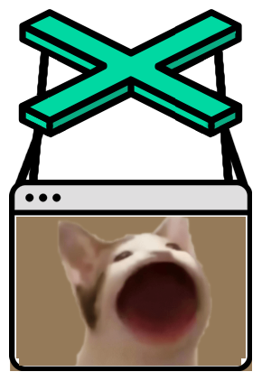
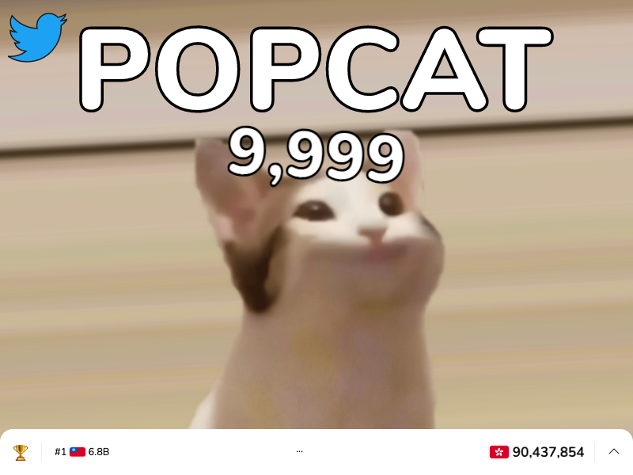
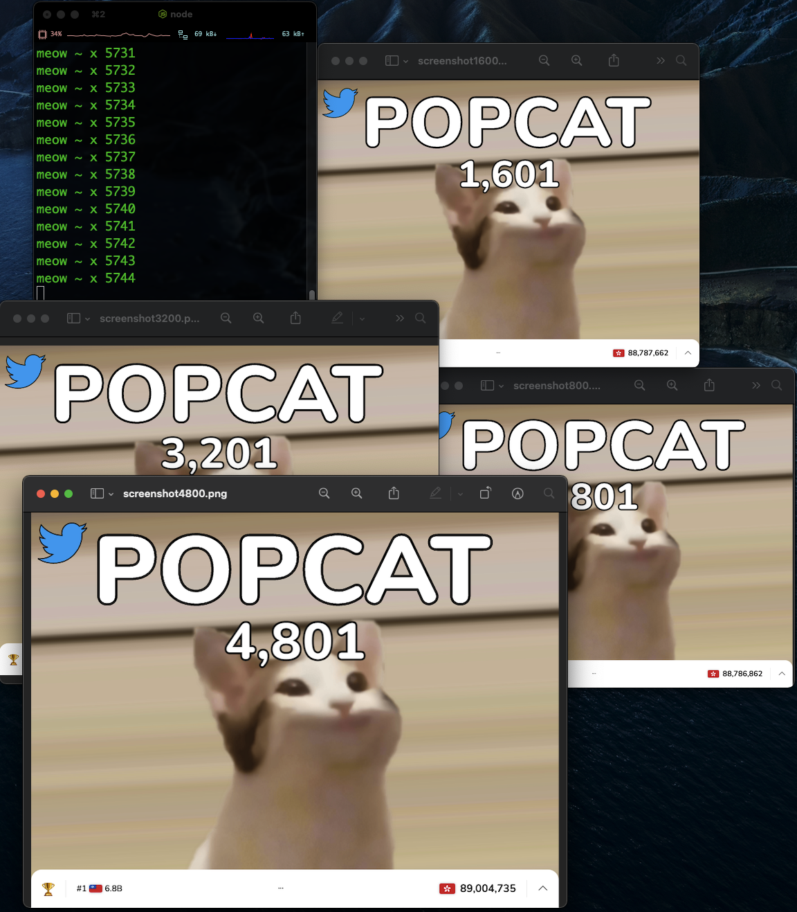

# Popcat Click Bot 🤖

 

## Such auto, Much meow 😹

This program is a toy project to demonstrate the idea of using node js with a headless chrome browser, and control the browser programmatically.

Currently it is setted to click 9999 times and take screenshot on 1st, every 801 times and 9999 times.

## Installation

Pull the repo in your local directory, `yarn` and run `node bot.js`

## Configuration

at the final line of bot.js, replace the total click number to your desired number of clicks.
